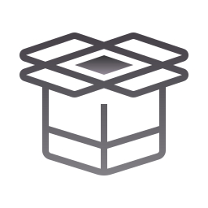

# Parcel Template
<div align="center">

</div>
A simple web development template built using Parcel, with support for SASS, PostHTML, and more. This template is designed to provide you with a convenient starting point for your web development projects.

## Getting Started

To begin using this template, follow these steps:

1. Clone this repository or use it as a template for your own project.

2. Install the project dependencies by running the following command in your terminal:

```sh
  npm install
```

4. Start the development server with live reloading:

```sh
   npm run dev
```

This will launch the development server at [http://localhost:7777](http://localhost:7777).

4. To build your project for production, use the following command:

```sh
   npm run build
```

The production-ready files will be generated in the `dist` directory.

## Scripts

This project comes with the following npm scripts:

```sh
npm run dev
```

Starts the development server with live reloading.

```sh
npm run build
```

Builds the project for production.

## Dependencies

This template uses the following external dependencies:

- `modern-normalize`: A modern alternative to the traditional CSS reset.

## Dev Dependencies

These are the development dependencies used in this project:

- `@parcel/transformer-sass`: A Parcel transformer for processing SASS.
- `parcel`: The Parcel bundler.
- `parcel-reporter-clean-dist`: A reporter for cleaning the output directory.
- `posthtml`: PostHTML, an HTML preprocessor.
- `posthtml-include`: A PostHTML plugin for including HTML files.

## Author

Author: [Liza Diachenko]
